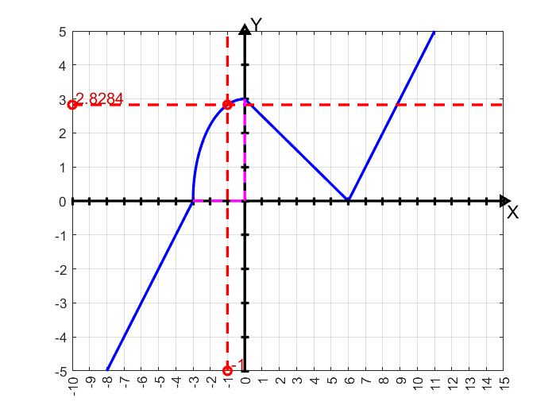

# Лабораторная 1. Вычисление значения функции
## Написать программу, которая по введённому значению аргумента вычисляет значение функции, заданной в виде графика. Параметр R вводится с клавиатуры
### В программе данные выделены в отдельный файл, созданы функции для определения y в соответствии с этими данными
#### P.S.: Программа усложнена для себя, для тренировки и восстановления знаний по языку С++

